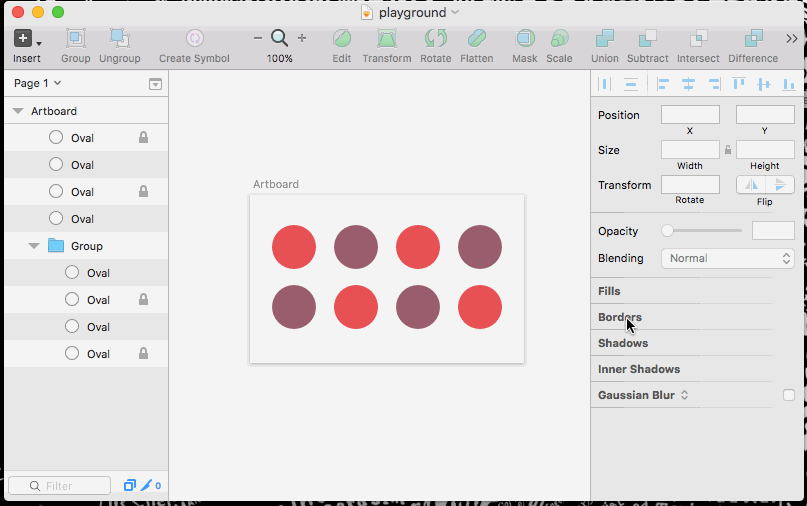
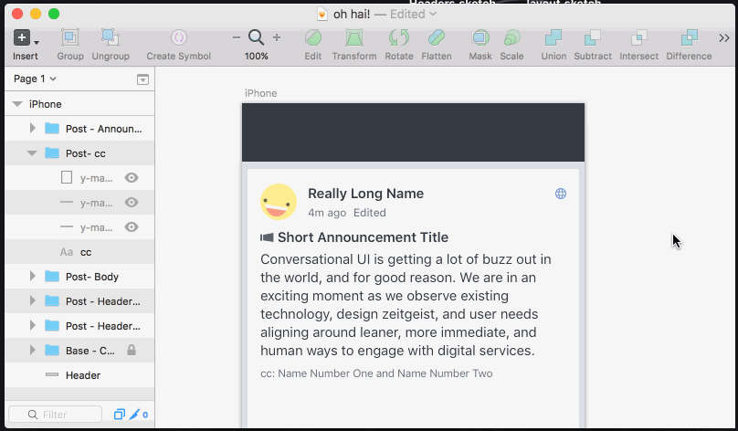
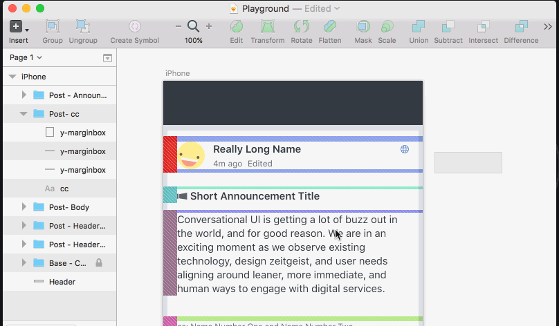
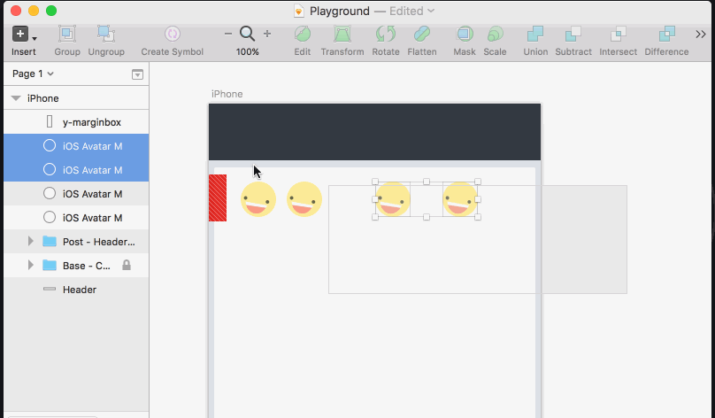
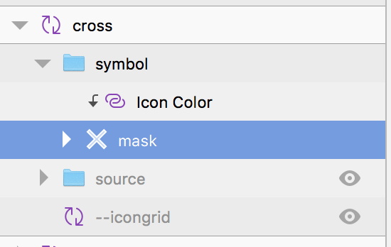

# Yammer Sketch Commands
Plugins and commands we use at Yammer.

## List of available commands

### Layers / 🔓 Unlock All the Layers
**Shortcut:** ctrl alt cmd u

Unlocks all the layers of the current artboard. If there are no artboards in the document, then it unlocks all the layers of the current page. 

We found inspiration in [this article](https://blog.truthlabs.com/sketch-plugin-unlock-all-layers-1ff9252f0689#.layqla2bc). 



### Layers / 👏 Toggle Margin Boxes
**Shortcut:** ctrl alt cmd m

Toggles the visibility of layers with named ```y-marginbox```, using the first element found as a reference for showing or hiding the elements. 

- If you don't select anything and you don't have artboards, it will toggle the layers of your current page. 
- If you are using artboards, it will toggle the layers of your current artboard.
- If you have selected some layers or groups, it will toggle just the layers included in the selection.



### Layers / :arrow_up: Compact Vertical Space
**Shortcut:** ctrl alt ↑

Distributes the selected elements vertically removing the spacing between them. The code is borrowed from @bomberstudios [Sketch Commands](https://github.com/bomberstudios/sketch-commands/blob/master/Sketch%20Commands.sketchplugin/Contents/Sketch/Align/Space%20Vertical.cocoascript) and slightly modified.



### Layers / :arrow_left: Compact Horizontal Space
**Shortcut:** ctrl alt ←

Distributes the selected elements horizontally removing the spacing between them. The code is borrowed from @bomberstudios [Sketch Commands](https://github.com/bomberstudios/sketch-commands/blob/master/Sketch%20Commands.sketchplugin/Contents/Sketch/Align/Space%20Horizontal.cocoascript) and slightly modified.



### Text / :scissors: Truncate text lines
**Shortcut:** ctrl alt cmd t

Cut the number of lines of a textbox, adding an ellipsis if needed. It works using words or characters.

Most of the ideas are taken from the [sketch data populator plugin](https://github.com/preciousforever/sketch-data-populator/).


### Icons / :ant: Export SVG Icons

Based on Yammer Icon MasterDoc conventions. The plugin only acts over the elements of the 
artboard 'icons' in the current page. This way we can manage icons also for different platform
with different export needs.

For making this plugin work you need to have SVGo installed. 
If you have brew, try ```brew install svgo```

Naming conventions:
- The export group needs to be in a "symbol" group
- The icon masking the color needs to be named "mask"



